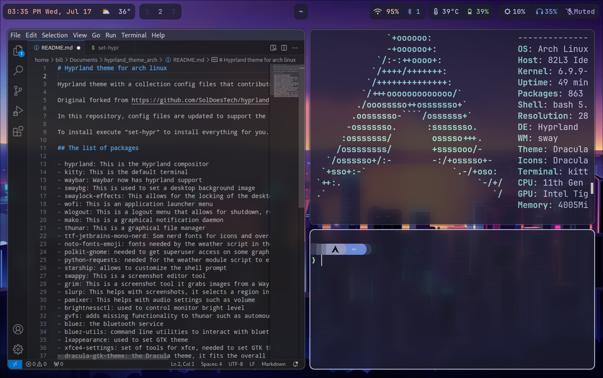

# Hyprland theme for arch linux

Hyprland theme with a collection of <code>.conf</code> files that contribute to the overall outlook.

_Original forked from https://github.com/SolDoesTech/hyprland (outdated, not licensed 18/7/24)_

In this repository, config files are updated to support the lasted changes from Hyprland and Waybar and also some bugs has been fixed.

## Bugs fixed

- **Waybar**
  - Time - date wrong format
  - Weather changed to Celsius and region added
  - Workspaces renamed to <code>hyprland/workspaces</code> in newer version
  - Bluetooth could not be displayed if it was blocked
  - Tempeture is now using the right sensor for monitoring
- **Hyprland**
  -  Touchbar scroll speed and direction
  -  Error code in master and device fixed (differents names in the newer versions) 
 

To install everything execute "set-hypr".

<code> sudo ./set-hypr </code>

## The list of packages

Will be installed with **yay**

- **hyprland**: The Hyprland compositor.
- **kitty**: The default terminal.
- **waybar**: Waybar now includes support for Hyprland.
- **swaybg**: Used to set a desktop background image.
- **swaylock-effects**: Desktop locking tool with additional visual effects, a fork with enhanced visuals.
- **wofi**: An application launcher menu.
- **wlogout**: A logout menu providing options for shutdown, reboot, and sleep.
- **mako**: A graphical notification daemon.
- **thunar**: A graphical file manager.
- **ttf-jetbrains-mono-nerd**: Nerd fonts for icons and aesthetic enhancement.
- **noto-fonts-emoji**: Fonts required by the weather script in the top bar.
- **polkit-gnome**: Needed for superuser access in some graphical applications.
- **python-requests**: Required for the weather module script.
- **starship**: Customizes the shell prompt.
- **swappy**: A screenshot editor tool.
- **grim**: A screenshot tool for capturing images from a Wayland compositor.
- **slurp**: Assists with screenshots by selecting a region in a Wayland compositor.
- **pamixer**: Manages audio settings, including volume.
- **brightnessctl**: Controls monitor brightness.
- **gvfs**: Adds functionality to Thunar, such as automounting USB drives.
- **bluez**: The Bluetooth service.
- **bluez-utils**: Command line utilities for interacting with Bluetooth devices.
- **lxappearance**: Sets the GTK theme.
- **xfce4-settings**: Tools for XFCE, needed to set the GTK theme.
- **dracula-gtk-theme**: The Dracula theme, complementing the overall aesthetic.
- **dracula-icons-git**: Icon set to match the Dracula theme.
- **xdg-desktop-portal-hyprland**: XDG desktop portal backend for Hyprland.

## MIT License

Copyright (c) 2024 Bill Chamalidis
